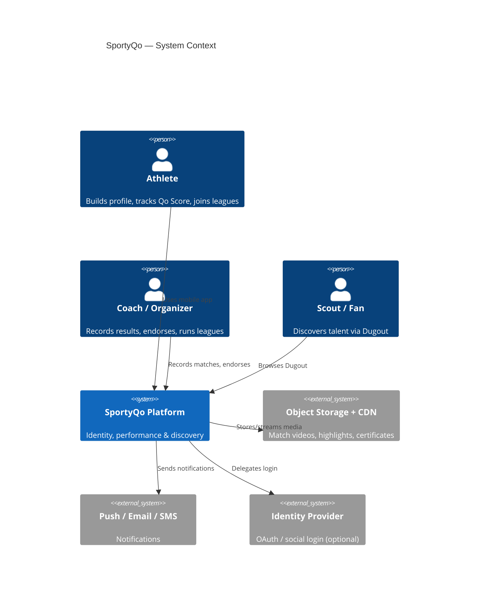
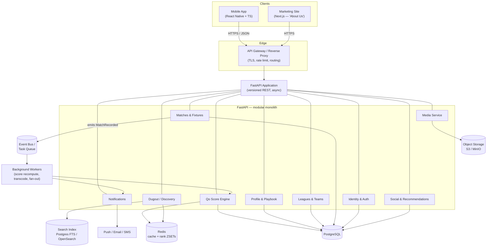
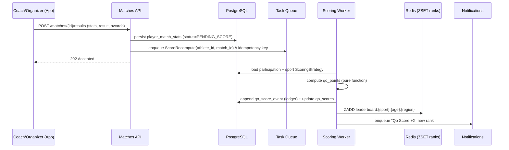
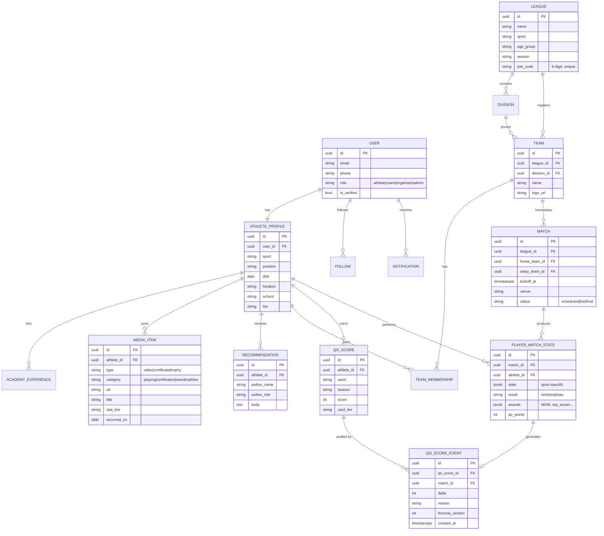
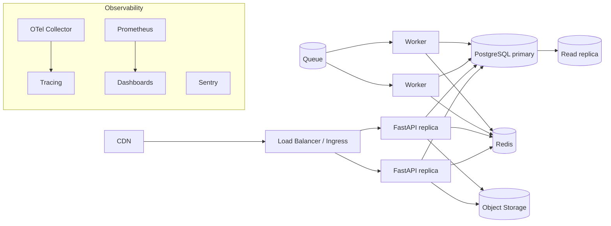

# SportyQo — System Architecture

> The grassroots performance & identity platform. Track · Connect · Compete.

This document describes the end-to-end architecture derived from the product screens
(About, Home, Join League, League Joined, Dugout, Playbook, Performance, Profile). It is
the single source of truth for how the system is decomposed, how data flows, and what the
backend and mobile app are each responsible for.

> **Note on illustrative values.** Some numbers in the mockups (e.g. Qo Score `720`/`Purple`
> on Home vs `242`/`Green` on Performance, and the Green→Yellow card ordering) are not
> internally consistent. They are treated here as *illustrative*. Card tiers and thresholds
> are modelled as configurable bands; exact values are a product decision (see
> [Qo Score Engine](#5-qo-score-engine)).

---

## 1. Product in one paragraph

SportyQo is a multi-sport (Cricket, Football, Basketball, Badminton, Athletics) identity and
performance platform for grassroots/youth athletes (U16 etc.). Each athlete owns a **profile**
(Profile + Playbook), accrues a **Qo Score** and **card tier** from verified match
performances, joins **leagues/teams** via a 6-digit code, tracks **performance** over a season,
and is **discoverable** by coaches and scouts through the **Dugout** leaderboard/feed.

---

## 2. Architecture goals

| Goal | How it shows up in the design |
|------|-------------------------------|
| **Enterprise-grade** | Layered, dependency-injected services; versioned API; migrations; RBAC; audit ledger for every Qo Score change. |
| **Easy to debug** | Structured JSON logs with request/correlation IDs, distributed tracing, RFC 9457 error envelopes, health probes, reproducible local stack via Docker Compose. |
| **Scalable reads** | Leaderboards & rankings served from Redis sorted sets; heavy feeds cached; media served from object storage/CDN. |
| **Trustworthy scores** | Qo Score computed by an isolated engine, event-sourced, idempotent, and replayable. |
| **Mobile-first** | Thin clients; all business logic on the server; offline-tolerant API contracts. |

---

## 3. System context



---

## 4. Container / high-level architecture



**Why a modular monolith (not microservices) on day one:** each module above has clean
boundaries (its own router, service, repository) and communicates internally via interfaces
and domain events. This keeps it simple to run and debug, while allowing any module — most
likely **Qo Score Engine**, **Media**, or **Discovery** — to be extracted into its own service
later without rewrites.

---

## 5. Qo Score Engine

The Qo Score is the heart of the product. It is an isolated, event-sourced subsystem so it can
be audited, replayed, and tuned independently.

### 5.1 Concept
- **Qo Score** — a per-athlete, per-sport, per-season performance index (0–1000 band).
- **Qo Points** — the signed delta applied to the score by a single match (e.g. `+63`, `+48`).
- **Card tier** — a gamified band derived from the score (e.g. Green / Yellow / Purple). Bands
  and labels are **configuration**, not code.
- **Rank** — the athlete's position within a leaderboard scope `(sport, age_group, region)`.

### 5.2 Inputs (per match participation)
Raw performance (sport-specific: runs, wickets, catches, goals, assists, points, titles),
match result (win/loss), awards (Man of the Match, Top Scorer), participation/consistency, and
optionally opponent strength. Sport-specific rules live behind a `ScoringStrategy` interface so
each sport can weight its own stats.

### 5.3 Flow (event-sourced & idempotent)



**Key properties**
- **Ledger, not just a value.** Every change writes a `qo_score_event` row (match, delta,
  reason, formula version). The current score is the fold of the ledger → fully auditable and
  replayable when the formula changes.
- **Idempotent.** Recompute is keyed by `(athlete_id, match_id, formula_version)` so retries
  never double-count.
- **Versioned formula.** Bumping `formula_version` lets you re-run history on a snapshot before
  promoting a new scoring model.
- **Rankings in Redis.** `ZADD` / `ZREVRANK` give O(log n) leaderboard reads for Dugout and the
  Performance "Rank #14 / 280" widget without scanning the DB.

---

## 6. Domain model (ERD)



---

## 7. Screen → capability mapping

| Screen | Primary module(s) | Notable backend work |
|--------|-------------------|----------------------|
| **About Us** (web) | — | Static/marketing (Next.js), CTA → signup. |
| **Home** | Profile, Score, Matches, Leagues | Aggregated dashboard endpoint (Qo Score + delta, active league, next match, join CTA). |
| **Join League** | Leagues | Validate 6-digit `join_code`, rate-limited, secure. |
| **League Joined** | Leagues, Teams | List teams in league → create `team_membership` → step state machine (Code→Team→Joined). |
| **Dugout** | Discovery | Search + filter by sport + sort by Qo Score (Redis ZSET / search index), verified badges, bookmarks. |
| **Playbook** | Profile, Media | Tabbed media (Playing/Certificates/Team/Trophies), presigned uploads, follower counts. |
| **Performance** | Score Engine | Qo Score, card progress bar, season journey series, recent matches with Qo Points, rank #/total. |
| **Profile** | Profile, Social | Academy timeline, recommendations, follow/message/share. |

---

## 8. Cross-cutting concerns

**Authentication & authorization** — OAuth2 password + refresh JWT (short-lived access,
rotating refresh). Role-based access (`athlete`, `coach`, `organizer`, `admin`). Only
coaches/organizers may record match results or endorse; athletes own their own media.

**API design** — REST, versioned under `/api/v1`, OpenAPI auto-generated, cursor pagination,
RFC 9457 (`application/problem+json`) error envelopes, ETag/`If-None-Match` on heavy reads.

**Observability** — structlog JSON logs, an `X-Request-ID` correlation header propagated end to
end, OpenTelemetry traces (FastAPI → SQLAlchemy → Redis → workers), Prometheus metrics
(`/metrics`), Sentry for exceptions.

**Caching** — Redis for: leaderboards (sorted sets), the Home dashboard aggregate, and Dugout
pages. Cache keys are versioned and invalidated on the relevant domain event.

**Media pipeline** — client requests a **presigned upload URL**, uploads directly to object
storage, then a worker transcodes/generates thumbnails and flips the `MEDIA_ITEM` to `ready`.
The app never proxies large files through the API.

**Security** — TLS everywhere, secrets via environment/secret manager (never committed),
input validation via Pydantic, rate limiting on auth + join-code endpoints, parameterized
queries via SQLAlchemy, audit ledger for score changes, least-privilege DB roles.

---

## 9. Deployment topology



- **Stateless API** replicas behind a load balancer → scale horizontally.
- **Workers** scale independently (score recompute is the bursty workload after match days).
- **Postgres** with a read replica for Dugout/analytics-heavy reads.
- **Local dev** mirrors prod via Docker Compose (api + worker + postgres + redis + minio +
  mailhog) so "works on my machine" == "works in the cluster".

---

## 10. Recommended technology stack

| Layer | Choice | Rationale |
|-------|--------|-----------|
| Mobile app | React Native (Expo) + TypeScript | Single codebase, matches the iOS-style mockups; native modules when needed. *(Flutter is a viable alternative.)* |
| Marketing site | Next.js | The "About Us" page; SEO + static. |
| API | FastAPI (async) + Uvicorn/Gunicorn | Type-safe, fast, auto OpenAPI, excellent DX for debugging. |
| Data | PostgreSQL + SQLAlchemy 2.0 (async) + Alembic | Relational integrity for leagues/matches; `jsonb` for sport-specific stats. |
| Cache / ranks | Redis | Sorted sets = leaderboards; caching; rate limiting. |
| Background jobs | ARQ or Celery | Async-native (ARQ) score recompute, media fan-out. |
| Search | Postgres FTS → OpenSearch (later) | Dugout search starts simple, scales out. |
| Media | S3 / MinIO + CDN | Presigned uploads, streaming. |
| Auth | OAuth2 + JWT (python-jose / Authlib) | Standard, stateless. |
| Observability | structlog, OpenTelemetry, Prometheus, Sentry | Debuggability is a first-class requirement. |
| Packaging | Docker + Docker Compose | Reproducible local + CI. |

---

## 11. Repository layout (monorepo)

```
sportyqo/
├── ARCHITECTURE.md          ← this document
├── backend/                 ← FastAPI service (see backend/README.md)
│   └── README.md
└── app/                     ← React Native mobile app (see app/README.md)
    └── README.md
```

See the two READMEs for setup, project structure, conventions, and debugging guides.
